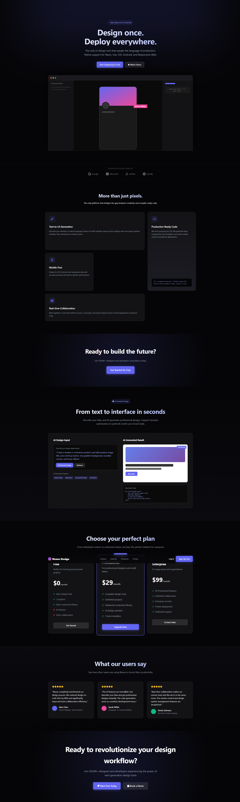
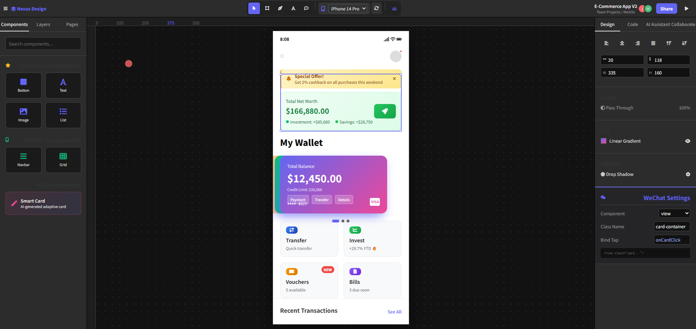
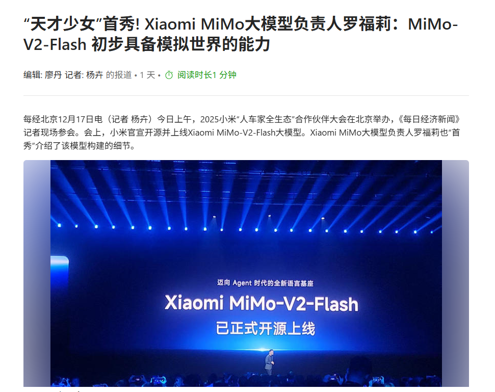
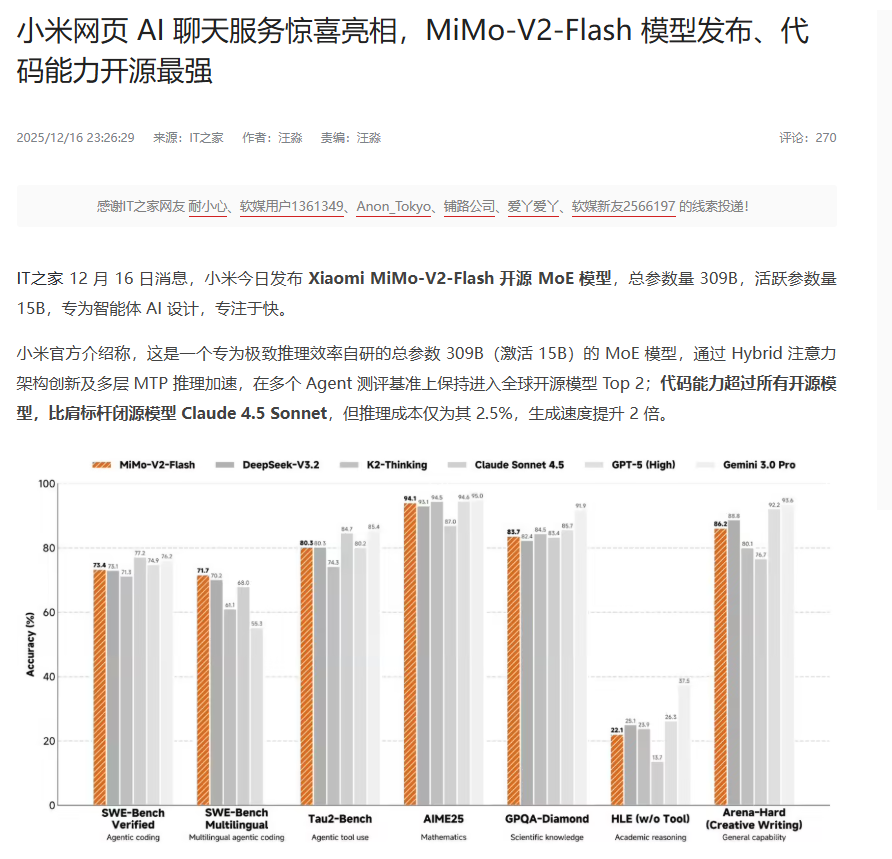
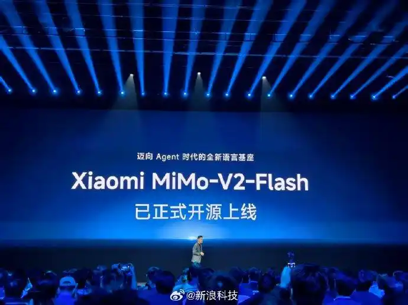

# Nexus Design - The Unified Design Platform

## 🎬 Product Preview

### 📱 Product Landing Page (landing.html)


### 🎨 Design Workspace (workspace.html)


## 📰 Media Coverage

### 🔥 News Screenshots





## 📋 Project Overview

Nexus Design is a revolutionary UI design tool that supports multi-platform design, including WeChat Mini-Programs, iOS apps, responsive websites, and more. Through AI-driven design generation and automatic code output, it enables seamless collaboration between designers and developers, achieving a design-to-code workflow.

**Core Development**: This project is entirely developed by **mimo-v2-flash**, from architecture design to code implementation, from security auditing to documentation, demonstrating the powerful capabilities of AI in modern software engineering.

## 🗂️ Project Structure

```
NexusDesign/
├── demo/                    # Demo Files
│   ├── landing.html        # Product Landing Page - Gemini 3 Pro Design
│   ├── auth.html           # Authentication Page - Gemini 3 Pro Design
│   └── workspace.html      # Design Workspace - Gemini 3 Pro Design
├── docs/                   # Design Documents
│   ├── OVERVIEW.md         # Project Overview - mimo-v2-flash Generated
│   ├── ARCHITECTURE.md     # Technical Architecture - mimo-v2-flash Generated
│   ├── DEVELOPMENT.md      # Development Guide - mimo-v2-flash Generated
│   ├── API.md              # API Documentation - mimo-v2-flash Generated
│   ├── DATABASE.md         # Database Design - mimo-v2-flash Generated
│   └── DEPLOYMENT.md       # Deployment Guide - mimo-v2-flash Generated
├── apps/web/               # Full-Stack Engineering Code - mimo-v2-flash Developed
│   ├── app/                # Next.js Application
│   ├── prisma/             # Database Models
│   └── ...                 # Complete Project Structure
├── README.md               # Chinese Documentation
├── README.en.md            # English Documentation
├── LICENSE                 # License File
├── SECURITY.md             # Security Guide
├── .env.example            # Environment Variables Template
└── turbo.json              # Turborepo Configuration
```

### 🎨 Design Sources

- **Demo Files** (`demo/*.html`): Generated by **Gemini 3 Pro**, providing visual references and interaction specifications
- **Design Documents** (`docs/*.md`): Generated by **mimo-v2-flash**, containing complete technical documentation
- **Full-Stack Code** (`apps/web/`, `packages/`): Developed by **mimo-v2-flash**, production-grade implementation

### 📄 Demo Files Description

These three HTML files generated by **Gemini 3 Pro** serve as **design references** and **function specifications** for product implementation:

- ✅ **Visual Standards**: Defines overall style, colors, and layout
- ✅ **Interaction Specifications**: Shows user interaction flows and details
- ✅ **Feature Scope**: Clarifies core functional modules to implement
- ✅ **User Experience**: Provides complete user journey demonstration

> **Usage Suggestion**: During development, reference these demo files to ensure implementation meets design expectations, while optimizing and expanding based on technical architecture.

## 🚀 Features

### 🏠 Landing Page (landing.html)
- **Product Showcase**: Complete product introduction and feature demonstration
- **Responsive Design**: Adapts to desktop, tablet, mobile and other devices
- **Pricing Plans**: Free, Professional, and Enterprise tiers
- **Customer Cases**: Real customer testimonials and use cases
- **Conversion Funnel**: Clear registration/login entry points

### 🔐 Authentication System (auth.html)
- **Dual Mode**: Seamless switching between login and registration forms
- **Demo Account**: demo / NexusDesign123 (Quick experience)
- **Social Login**: Google, GitHub, Apple account login
- **Form Validation**: Complete frontend validation mechanism
- **Remember Login**: localStorage user information storage

### 🎨 Design Workspace (workspace.html)
- **Multi-Device Preview**: 6 devices including iPhone, Android, iPad, Desktop
- **Screen Rotation**: Portrait/Landscape mode switching with smooth animations
- **Component Library**: Drag-and-drop UI components for common, mobile, and AI components
- **Real Application**: Complete financial app interface demonstration
- **Code Generation**: Multi-platform code output for React, Vue, Angular
- **AI Assistant**: Intelligent design suggestions and automation features
- **Collaboration Features**: Real-time collaboration, version control, comment system

## 💼 Core Value

### 🎯 Design as Code
- Design directly generates production-ready code
- Supports React, Vue, Angular, WeChat Mini-Programs
- Automatic responsive layout adaptation

### 🤖 AI-Driven Design
- Text description to UI interface generation
- Intelligent layout suggestions
- Automatic component recommendations

### 👥 Team Collaboration
- Real-time multi-user editing
- Version control and history rollback
- Comment and feedback system

## 🎮 Quick Start

### 1. Visit Product Landing Page
```
Open landing.html to learn about product features
```

### 2. Register/Login Account
```
Click "Sign Up Free" or "Log in" to go to authentication page
Use demo account: demo / NexusDesign123 for quick experience
```

### 3. Enter Design Workspace
```
Auto-redirect to workspace.html after successful login
Experience complete design tool functionality
```

## 📱 Device Support

### 📲 Mobile Devices
- iPhone 14 Pro (375x812px)
- iPhone 14 (390x844px)
- Android (384x854px)

### 💻 Desktop Devices
- iPad Pro (1024x1366px)
- Desktop (1440x900px)
- Tablet (768x1024px)

### 🔄 Screen Modes
- Portrait Mode
- Landscape Mode

## 🎨 Design System

### 🎨 Theme Colors
```css
--bg-dark: #050507      /* Dark background */
--bg-card: #131316      /* Card background */
--primary: #6366f1      /* Primary color - Indigo */
--accent: #ec4899       /* Accent color - Pink */
--text-main: #ffffff    /* Main text */
--text-muted: #9ca3af   /* Muted text */
```

### ✨ Interactive Effects
- **Hover Animations**: Visual feedback for all interactive elements
- **Transition Animations**: Smooth state switching effects
- **Loading Animations**: Simulate real API calls
- **Drag Interactions**: Component dragging and canvas movement

## 🛠️ Tech Stack

### Core Framework
- **Next.js 15**: React 18 + App Router
- **TypeScript**: Type Safety
- **Turborepo**: Multi-package Management
- **Prisma**: ORM + PostgreSQL

### Frontend Technologies
- **React 18**: Component-Based Development
- **Tailwind CSS**: Utility-First Styling
- **shadcn/ui**: Reusable Components
- **Zustand**: State Management
- **NextAuth.js**: Authentication

### AI Integration
- **OpenAI API**: AI Generation Capability
- **GPT-4 Turbo**: Natural Language Processing

### Development Tools
- **ESLint**: Code Linting
- **Prettier**: Code Formatting
- **Husky**: Git Hooks
- **Vitest**: Unit Testing
- **Playwright**: E2E Testing

## 📊 Demo Data

### 💳 Financial App Demo
- **Total Assets**: $166,880.00
- **Investment Returns**: +28.7% YTD
- **Bank Cards**: 3 different types of bank cards
- **Transaction Records**: Real transaction flow data
- **Feature Modules**: Transfer, Investment, Coupons, Bills, etc.

### 👥 User Data
- **Demo Account**: demo / NexusDesign123
- **Team Collaboration**: Simulated multi-user online editing
- **Version History**: Design version management demo

## 🎯 Use Cases

### 🏢 Enterprise Teams
- **Product Managers**: Rapid prototyping
- **UI Designers**: High-fidelity interface design
- **Frontend Developers**: Direct production code access
- **Project Managers**: Progress tracking and collaboration

### 🚀 Startups
- **MVP Development**: Rapid product prototyping
- **Design Systems**: Unified design language
- **Team Collaboration**: Remote team collaboration
- **Cost Control**: Reduce design-to-development time costs

## 📈 Performance Optimization

### ⚡ Loading Optimization
- **Code Splitting**: On-demand JavaScript loading
- **CSS Optimization**: Critical CSS inline
- **Image Optimization**: Modern image formats

### 🎭 User Experience
- **Instant Feedback**: Visual feedback for all operations
- **Error Handling**: Friendly error message prompts
- **Loading States**: Clear loading progress indicators

## 🔮 Future Roadmap

### 🚀 Short-term Goals
- [ ] More device preset support
- [ ] Component library expansion
- [ ] Enhanced AI features
- [ ] Improved collaboration features

### 🎯 Long-term Vision
- [ ] Plugin ecosystem
- [ ] Open API platform
- [ ] Enterprise deployment solutions
- [ ] Internationalization support

## 🤖 Development Team

### 🎯 Development Model
This project adopts an **AI-Driven Development** approach:

| Phase | Tool/Model | Output |
|-------|------------|--------|
| 🎨 UI Design | **Gemini 3 Pro** | Demo Files (landing.html, auth.html, workspace.html) |
| 📚 Documentation | **mimo-v2-flash** | Complete Design Docs (docs/*.md) |
| 💻 Engineering | **mimo-v2-flash** | Full-Stack Code (apps/web/, packages/) |
| 🔒 Security Audit | **mimo-v2-flash** | Security Guide (SECURITY.md) |

### 🔧 Technical Lead
- **Model**: mimo-v2-flash
- **Role**: Full-Stack Architect + Development Engineer
- **Responsibilities**:
  - System Architecture Design
  - Database Modeling
  - API Development
  - Frontend Component Implementation
  - Security Hardening
  - Documentation Writing

### 📝 Development Log
- **2025-12-18**: v1.0.0 Foundation Complete
  - Next.js + Turborepo + Prisma
  - Authentication System (NextAuth)
  - Design Editor Core
  - AI Generation Integration
  - Security Audit Passed

## 📞 Contact Us

### 🌐 Official Website
- **Product Homepage**: landing.html (Gemini 3 Pro Design)
- **Design Workspace**: workspace.html (Gemini 3 Pro Design)
- **Technical Support**: auth.html (Gemini 3 Pro Design)

### 🤖 Technical Support
- **Dev Docs**: docs/ (mimo-v2-flash Generated)
- **Repository**: https://gitee.com/sun_qiikai/nexus-design
- **Security Report**: SECURITY.md

### 📧 Business Cooperation
- **Enterprise Customization**: Private deployment support
- **Technical Training**: AI-Driven Development Training
- **API Integration**: Open platform cooperation

## 📄 License

This project is for demonstration and learning purposes only, please do not use for commercial purposes.

---

**Nexus Design** - AI-Driven Design-to-Code Platform 🚀

*Design by Gemini 3 Pro · Documentation by mimo-v2-flash · Code by mimo-v2-flash*